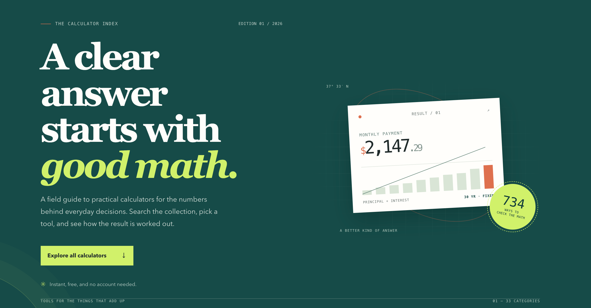

# Awesome CalcDelta Calculators

<p align="center">
  <a href="https://calcdelta.com/">
    
  </a>
</p>

> A searchable directory for the calculators offered by [CalcDelta](https://calcdelta.com/), the product maintained in the [CalcDelta project repository](https://github.com/hqzhon/calc).

**Project relationship:** this directory is affiliated with CalcDelta and links directly to its calculator pages. CalcDelta's calculator implementation is **not open source**. This repository contains the directory website and a catalog snapshot; it is not a source-code mirror and does not include the calculator implementation.

## Project links

- **Product:** [CalcDelta](https://calcdelta.com/)
- **CalcDelta project repository:** [github.com/hqzhon/calc](https://github.com/hqzhon/calc) — project source is private.
- **Directory site repository:** [github.com/hqzhon/calculators-awesome](https://github.com/hqzhon/calculators-awesome).

## Browse the directory

The site lists 734 English calculators across 33 categories in this snapshot. Search by name or description, filter by category, and open each calculator on the official [CalcDelta website](https://calcdelta.com/).

### Categories

[Automotive][category-automotive] · [Cleaning][category-cleaning] · [Construction][category-construction] · [Conversion][category-conversion] · [Cooking][category-cooking] · [Crypto][category-crypto] · [Date & time][category-date-time] · [DIY & craft][category-diy-craft] · [Education][category-education] · [Electrical][category-electrical] · [Everyday][category-everyday] · [Fashion][category-fashion] · [Finance][category-finance] · [Fun][category-fun] · [Gaming][category-gaming] · [Gardening][category-gardening] · [Geometry][category-geometry] · [Health][category-health] · [Household][category-household] · [Math][category-math] · [Moving][category-moving] · [Music][category-music] · [Party][category-party] · [Pets][category-pets] · [Photography][category-photography] · [Productivity][category-productivity] · [Science][category-science] · [Shopping][category-shopping] · [Social media][category-social-media] · [Sports][category-sports] · [Statistics][category-statistics] · [Travel][category-travel] · [Weather][category-weather]

The directory site is a dependency-free static page. To preview it locally, serve the repository root over HTTP:

```sh
python3 -m http.server 4173
```

Then open <http://localhost:4173>.

## Keep the catalog current

The catalog is generated from CalcDelta's private source checkout. From the CalcDelta repository, run:

```sh
node /path/to/calc-awesome/scripts/refresh-catalog.mjs
```

The script reads `data/calculators/*.json` and refreshes this repository's `data/calculators.json` with English titles, descriptions, categories, input counts, and official calculator URLs. Review the resulting changes before publishing.

## Deploy

This repository includes a GitHub Actions workflow for publishing to GitHub Pages from `main`. Enable Pages with GitHub Actions as the source to publish it; the Pages URL is not live yet. It can also be hosted on another static file service. There is no package install, build step, tracking script, or calculator API in this directory site.

## Featured calculators

Here are 20 useful picks from the catalog, spanning common finance, health, date, math, home, and planning tasks:

- [Mortgage Calculator][calc-mortgage] — Estimate a monthly payment with taxes, insurance, PMI, HOA, and extra payments.
- [Compound Interest Calculator][calc-compound-interest] — Project growth with flexible compounding frequency.
- [Loan Calculator][calc-loan] — See monthly payments, total repayment, and interest for a fixed-rate loan.
- [Savings Calculator][calc-savings] — Project savings with a starting balance, regular deposits, and interest.
- [Percentage Calculator][calc-percentage] — Find what percent one number is of another.
- [Fraction Calculator][calc-fraction] — Calculate with fractions.
- [BMI Calculator][calc-bmi] — Calculate body mass index; it is a screening measure, not a diagnosis.
- [Calorie Calculator][calc-calorie] — Estimate basal metabolic rate and daily calories for weight maintenance.
- [Date Calculator][calc-date] — Add or subtract days, weeks, months, and years from a date.
- [Date Difference Calculator][calc-date-difference] — Find the time between two dates in days, weeks, months, and years.
- [Time Duration Calculator][calc-time-duration] — Calculate the duration between times.
- [Age Calculator][calc-age] — Calculate exact age from a date of birth.
- [Cooking Measurement Converter][calc-cooking-measurement] — Convert common cooking measurements.
- [Recipe Scaler][calc-recipe-scaler] — Scale ingredient quantities to a different serving size.
- [Area Converter][calc-area] — Convert area units including square metres, acres, and square feet.
- [Fuel Cost Calculator][calc-fuel-cost] — Estimate trip fuel cost from distance, fuel economy, and price.
- [Concrete Slab Calculator][calc-concrete] — Estimate concrete volume and bag count for a slab or pad.
- [Paint Calculator][calc-paint] — Estimate paint needed for a project.
- [Tip Calculator][calc-tip] — Calculate a tip and split the bill between people.
- [GPA Calculator][calc-gpa] — Calculate a grade point average from grades and credit hours.

## Attribution

CalcDelta is maintained by [Jackie Zhong](https://github.com/hqzhon). The calculator product is at [calcdelta.com](https://calcdelta.com/); its project repository is [github.com/hqzhon/calc](https://github.com/hqzhon/calc). The directory is a separate index for that product, not an independent calculator engine.

[category-automotive]: https://calcdelta.com/automotive/
[category-cleaning]: https://calcdelta.com/cleaning/
[category-construction]: https://calcdelta.com/construction/
[category-conversion]: https://calcdelta.com/conversion/
[category-cooking]: https://calcdelta.com/cooking/
[category-crypto]: https://calcdelta.com/crypto/
[category-date-time]: https://calcdelta.com/date-time/
[category-diy-craft]: https://calcdelta.com/diy-craft/
[category-education]: https://calcdelta.com/education/
[category-electrical]: https://calcdelta.com/electrical/
[category-everyday]: https://calcdelta.com/everyday/
[category-fashion]: https://calcdelta.com/fashion/
[category-finance]: https://calcdelta.com/finance/
[category-fun]: https://calcdelta.com/fun/
[category-gaming]: https://calcdelta.com/gaming/
[category-gardening]: https://calcdelta.com/gardening/
[category-geometry]: https://calcdelta.com/geometry/
[category-health]: https://calcdelta.com/health/
[category-household]: https://calcdelta.com/household/
[category-math]: https://calcdelta.com/math/
[category-moving]: https://calcdelta.com/moving/
[category-music]: https://calcdelta.com/music/
[category-party]: https://calcdelta.com/party/
[category-pets]: https://calcdelta.com/pets/
[category-photography]: https://calcdelta.com/photography/
[category-productivity]: https://calcdelta.com/productivity/
[category-science]: https://calcdelta.com/science/
[category-shopping]: https://calcdelta.com/shopping/
[category-social-media]: https://calcdelta.com/social-media/
[category-sports]: https://calcdelta.com/sports/
[category-statistics]: https://calcdelta.com/statistics/
[category-travel]: https://calcdelta.com/travel/
[category-weather]: https://calcdelta.com/weather/

[calc-mortgage]: https://calcdelta.com/mortgage-calculator/
[calc-compound-interest]: https://calcdelta.com/compound-interest-calculator/
[calc-loan]: https://calcdelta.com/loan-calculator/
[calc-savings]: https://calcdelta.com/savings-calculator/
[calc-percentage]: https://calcdelta.com/percentage-calculator/
[calc-fraction]: https://calcdelta.com/fraction-calculator/
[calc-bmi]: https://calcdelta.com/bmi-calculator/
[calc-calorie]: https://calcdelta.com/calorie-calculator/
[calc-date]: https://calcdelta.com/date-calculator/
[calc-date-difference]: https://calcdelta.com/date-difference-calculator/
[calc-time-duration]: https://calcdelta.com/time-duration-calculator/
[calc-age]: https://calcdelta.com/age-calculator/
[calc-cooking-measurement]: https://calcdelta.com/cooking-measurement-converter/
[calc-recipe-scaler]: https://calcdelta.com/recipe-scaler-calculator/
[calc-area]: https://calcdelta.com/area-calculator/
[calc-fuel-cost]: https://calcdelta.com/fuel-cost-calculator/
[calc-concrete]: https://calcdelta.com/concrete-calculator/
[calc-paint]: https://calcdelta.com/paint-calculator/
[calc-tip]: https://calcdelta.com/tip-calculator/
[calc-gpa]: https://calcdelta.com/gpa-calculator/
